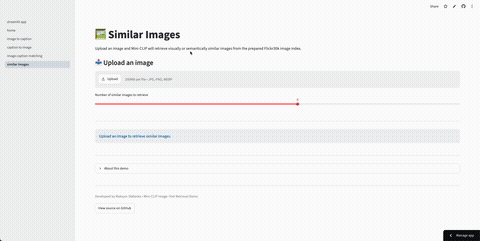
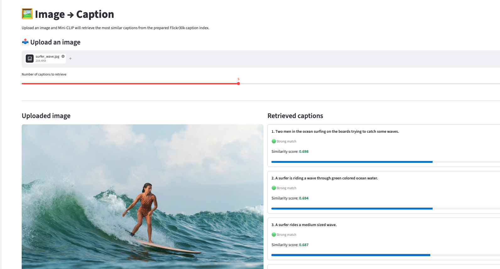
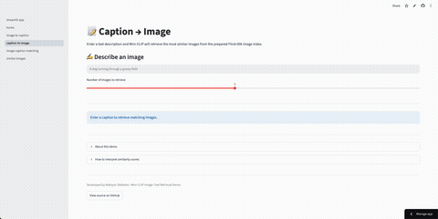
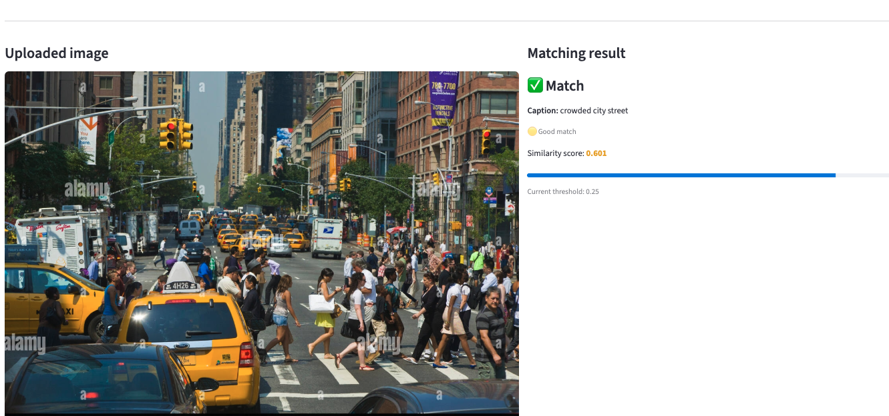
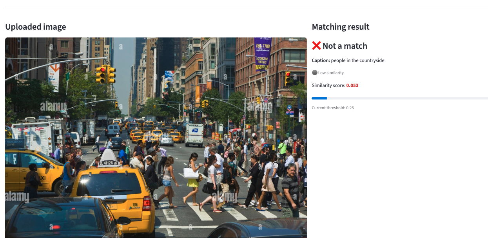

# Mini-CLIP: Multimodal Image-Text Retrieval

<p align="center">
  
</p>

*A lightweight CLIP-style model for image-text retrieval trained on the Flickr30k dataset using contrastive learning.*

🚀 **Live Demo (Streamlit):** https://flickr30k-mini-clip-explorer.streamlit.app/home

🌐 **REST API (Swagger):** https://flickr30k-multimodal-retrieval.onrender.com/docs

📖 **REST API (ReDoc):** https://flickr30k-multimodal-retrieval.onrender.com/redoc

📂 **Project Repository:** https://github.com/Maxstef/flickr30k-multimodal-retrieval

---

## Overview

This project explores multimodal representation learning by building a lightweight CLIP-style model capable of understanding the semantic relationship between images and natural language.

Starting from a simple multimodal baseline, the project progressively introduces transfer learning, contrastive learning, and retrieval techniques to learn a shared embedding space for images and text. Throughout the project, multiple model architectures are implemented, evaluated, and compared, demonstrating how modern multimodal representations significantly improve image-text understanding.

The final solution consists of both an interactive Streamlit application and a production-style FastAPI service exposing the Mini-CLIP model through a REST API. Together, they demonstrate semantic retrieval, image-text matching, and image similarity search using a shared embedding space learned through contrastive learning.

## Architecture Diagram

```text
                         Mini-CLIP Project Architecture

                 ┌─────────────────────────────┐
                 │     Trained Mini-CLIP       │
                 │  (Shared Image/Text Space)  │
                 └──────────────┬──────────────┘
                                │
                    Shared Inference Layer
                                │
        ┌───────────────────────┼────────────────────────┐
        │                       │                        │
        ▼                       ▼                        ▼
  Image Encoder          Text Encoder          Retrieval Engine
 (ResNet18 CNN)       (Token Embeddings +      (Cosine Similarity)
                         Mean Pooling)
        │                       │                        │
        └───────────────────────┴────────────────────────┘
                                │
                  Precomputed Image & Caption Embeddings
                                │
                ┌───────────────┴───────────────┐
                │                               │
                ▼                               ▼
      Streamlit Web App                FastAPI REST API
      - Interactive UI                 - Image → Caption
      - Visual Demo                    - Caption → Image
      - Similar Images                 - Similar Images
      - Image Matching                 - Image + Caption Match
```

## Application Features

The interactive Streamlit application showcases several multimodal retrieval and matching tasks powered by the trained Mini-CLIP model.

### 🖼️ Image → Caption Retrieval

Upload an image and retrieve the most semantically similar captions from the Flickr30k caption index.

<p align="center">
  
</p>

---

### 📝 Caption → Image Retrieval

Enter a text description and retrieve the most semantically similar images from the Flickr30k image index.

<p align="center">
  
</p>

---

### 🔗 Image + Caption Matching

Compare an uploaded image and a text description using cosine similarity in the shared embedding space. The application predicts whether the image and caption represent a semantic match.

#### Positive Match

<p align="center">
  
</p>

#### Negative Match

<p align="center">
  
</p>

---

### 🖼️ Similar Image Retrieval

Retrieve visually and semantically similar images from the prepared Flickr30k image index. The application also generates a lightweight caption-based explanation to help interpret the retrieval results.

<p align="center">
  
</p>

## REST API

In addition to the interactive Streamlit application, the project provides a publicly available FastAPI service for programmatic access to the Mini-CLIP model.

### Live API

- Swagger UI: https://flickr30k-multimodal-retrieval.onrender.com/docs
- ReDoc: https://flickr30k-multimodal-retrieval.onrender.com/redoc

### Available Endpoints

| Endpoint | Description |
|-----------|-------------|
| `POST /image-caption-match` | Predict whether an image and caption semantically match. |
| `POST /image-to-caption` | Retrieve the most relevant captions for an uploaded image. |
| `POST /caption-to-image` | Retrieve the most relevant images for a text query. |
| `POST /similar-images` | Retrieve visually and semantically similar images. |
| `GET /images/{filename}` | Download an image returned by retrieval endpoints. |

The API is implemented using **FastAPI**, automatically generates OpenAPI documentation, and shares the same inference pipeline as the Streamlit application.

## Model Evolution

Rather than implementing a single solution, this project follows an incremental development approach. Each stage introduces a more capable model while building on the knowledge and components from the previous one.

| Stage | Model | Description |
|-------|-------|-------------|
| 1 | **Multimodal MLP** | Baseline image-text matching model trained on concatenated frozen ResNet18 image embeddings and TF-IDF caption features. The MLP learns nonlinear interactions between the two modalities. |
| 2 | **Frozen ResNet18** | Neural multimodal model with a pretrained ResNet18 image encoder (frozen weights), a trainable text encoder, and a classification head. |
| 3 | **Fine-tuned ResNet18** | End-to-end image-text matching model that fine-tunes the ResNet18 visual encoder to learn task-specific image representations. |
| 4 | **Mini-CLIP** | Lightweight CLIP-style model trained with contrastive learning to project images and text into a shared embedding space for cross-modal retrieval. |

The final Mini-CLIP model enables multiple downstream tasks, including image-to-caption retrieval, caption-to-image retrieval, image-text matching, and image similarity search, all using cosine similarity in the learned embedding space.

## Final Results

The models were evaluated on the Flickr30k validation set using binary image-text matching. Performance is reported using standard classification metrics.

| Model | Accuracy | Precision | Recall | F1-score | Training Time |
|:------|---------:|----------:|-------:|---------:|---------:|
| Multimodal MLP | 0.641 | 0.715 | 0.470 | 0.567 | 5.82 min |
| Frozen ResNet18 | 0.740 | 0.667 | 0.957 | 0.786 | 11.14 min |
| Fine-tuned ResNet18 | 0.761 | 0.755 | 0.775 | 0.765 | 2 h 46 min |
| **Mini-CLIP (Contrastive Learning)** | **0.888** | **0.880** | **0.899** | **0.889** | **15.61 min** |

The results demonstrate the effectiveness of contrastive learning for multimodal representation learning. While the baseline and transfer learning models provide solid image-text matching performance, the Mini-CLIP model achieves the best overall balance across all evaluation metrics.

More importantly, learning a shared embedding space enables multiple downstream tasks—including image-to-caption retrieval, caption-to-image retrieval, image similarity search, and semantic image-text matching—all using the same learned representations.

## Repository Structure

```text
flickr30k-multimodal-retrieval/
│
├── api/                 # FastAPI REST service
├── app/                 # Streamlit application
├── app_data/            # Demo images, embeddings, and metadata
├── assets/              # README screenshots, GIFs, and diagrams
├── models/              # Trained model checkpoints
├── notebooks/           # End-to-end development notebooks
├── scripts/             # Utility and data preparation scripts
├── src/                 # Core source code & Shared inference and retrieval logic
│
├── environment.yml      # Conda environment
├── requirements.txt     # Python dependencies
└── README.md
```

## Technologies

- Python
- PyTorch
- TorchVision
- FastAPI
- Uvicorn
- Streamlit
- Docker
- NumPy
- Pandas
- scikit-learn
- Hugging Face Datasets
- Pillow

## Dataset

This project uses the **Flickr30k** dataset, one of the most widely used benchmarks for image-text retrieval, image captioning, and multimodal representation learning.

The dataset contains:

- ~31,000 images
- ~159,000 human-written captions
- Five captions per image

Originally introduced by **Young et al. (2014)** in *From Image Descriptions to Visual Denotations: New Similarity Metrics for Semantic Inference over Event Descriptions*, Flickr30k remains a popular educational and research dataset thanks to its high-quality human annotations and manageable size.

**Resources**

- Dataset: https://shannon.cs.illinois.edu/DenotationGraph/
- Paper: https://aclanthology.org/Q14-1006/

> **Note:** To keep the Streamlit application lightweight and responsive, the deployed demo uses a prepared subset of approximately **1,000 images** and **5,000 captions** with precomputed embeddings for retrieval.

## Getting Started

### Clone the repository

```bash
git clone https://github.com/Maxstef/flickr30k-multimodal-retrieval.git

cd flickr30k-multimodal-retrieval
```

### Create the environment

Using Conda:

```bash
conda env create -f environment.yml

conda activate flickr30k
```

Or install the Python dependencies directly:

```bash
pip install -r requirements.txt
```

### Launch the Streamlit application

```bash
streamlit run app/streamlit_app.py
```

The application will be available at:

```
http://localhost:8501
```
### Run the REST API

```bash
uvicorn api.main:app --reload
```

The API will be available at:

```
http://localhost:8000
```

Interactive documentation:

```
http://localhost:8000/docs
```

Alternative documentation:

```
http://localhost:8000/redoc
```

## Future Improvements

Possible extensions of this project include:

- Replacing the current text encoder with a sequence-aware architecture (e.g. Transformer or BERT-style encoder) to better capture word order and contextual semantics.
- Scaling retrieval to the complete Flickr30k dataset or larger multimodal datasets.
- Experimenting with more powerful vision encoders (e.g. Vision Transformers or ConvNeXt).
- Integrating approximate nearest neighbor search (e.g. FAISS) for efficient large-scale retrieval.
- Evaluating the model on additional multimodal benchmarks.
- Improving retrieval explainability using modern vision-language models.

## Acknowledgements

This project was inspired by recent advances in multimodal representation learning, particularly CLIP-style contrastive learning.

Special thanks to the creators of the Flickr30k dataset for providing a high-quality benchmark for image-text understanding research.

### References

Young, P., Lai, A., Hodosh, M., & Hockenmaier, J. (2014). *From Image Descriptions to Visual Denotations: New Similarity Metrics for Semantic Inference over Event Descriptions.*

https://aclanthology.org/Q14-1006/

## Key Learnings

This project provided hands-on experience with:

- Contrastive learning for multimodal representation learning
- Transfer learning using pretrained CNN encoders
- Image-text retrieval with shared embedding spaces
- Cosine similarity search for cross-modal retrieval
- Building and deploying interactive machine learning applications with Streamlit
- Organizing an end-to-end deep learning project from experimentation to deployment
- Designing and implementing REST APIs with FastAPI
- Building reusable ML inference services
- Dockerizing machine learning applications
- Deploying cloud-hosted inference services on Render
